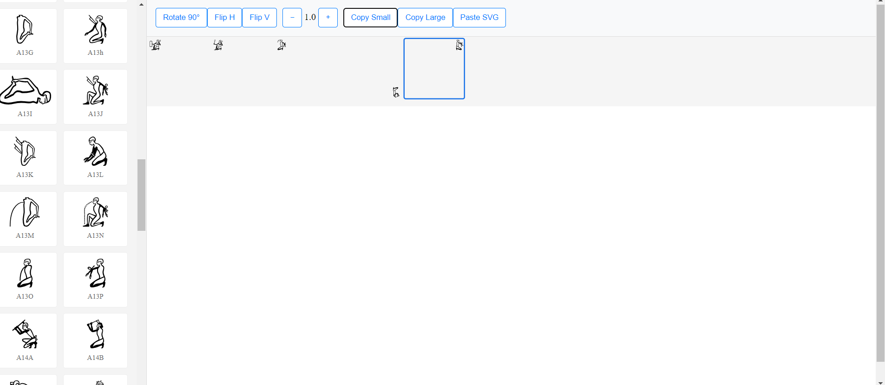
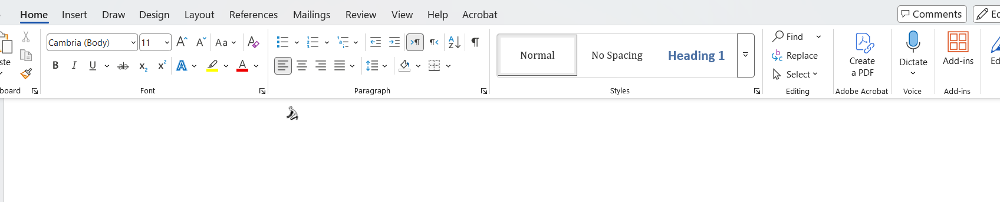

# 🎨 SVG Glyph Editor: Professional Manipulation Workspace (.NET 9 & Angular 19)

A **production-grade vector manipulation tool** specifically engineered for handling ancient Egyptian hieroglyphics (JSesh format). This solution provides a robust workspace for composing, transforming, and exporting complex SVG layouts into professional document editors with high fidelity.

---

## 🎯 Why This Project?

Traditional text editors struggle with complex vector glyphs. This project provides a specialized environment to:

* **Precise Control**: Rotate, scale, and flip individual vector elements without losing path quality.
* **Figma-like UX**: Advanced selection logic supporting multi-select (Ctrl/Cmd) and click-to-deselect.
* **Seamless Integration**: A custom clipboard engine that bridges web-based SVGs with Microsoft Word and Google Docs via PNG conversion.
* **Reactive Performance**: Leverages Angular Signals for an ultra-fast UI that remains stable even with high element density.

---

## 🏗️ Architecture Principles

### Reactive State Management
* **Signals Core**: The entire editor state (items, selection, transforms) is managed via `WritableSignal` for $O(1)$ performance.
* **Set-based Selection**: Uses `Set<string>` for selection IDs to ensure unique values and instant lookups.

### Transformation Logic
* **Center-point Mapping**: Custom mathematical transforms to ensure rotations and scales occur from the glyph's center $(900, 900)$, preventing "jumping" during edits.
* **Sanitized Rendering**: On-the-fly SVG cleaning to strip XML namespaces and metadata before canvas injection.

---

## 📸 Technical Results & Demo

### 1. Interactive Workspace & Glyph Library
*The main editor interface featuring a dynamic glyph library and an automated grid placement system for seamless composition.*

**Figure 1: Live application workspace with integrated Egyptian hieroglyphic library **

### 2. Enterprise Workflow Integration
*Proven compatibility with professional word processors, ensuring high-fidelity vector-to-bitmap rendering for academic and professional use*

**Figure 2: Successful high-resolution glyph export into Microsoft Word via the custom clipboard engine.**

---

## 🚀 Key Features

### 🏗️ Manipulation Core
* **Non-Destructive Scaling**: Precise scale factors applied via SVG transform matrices.
* **Rotation Engine**: Incremental 90-degree rotations with proper coordinate re-mapping.
* **Mirroring**: Instant Horizontal and Vertical flipping for aesthetic glyph orientation.

### 🛡️ Export Engine (Clipboard Pro)
* **Vector-to-Bitmap**: Uses HTML5 Canvas to render SVG groups into high-resolution PNGs.
* **Word Compatibility**: Injects a white background layer to prevent "drawing object" errors in MS Office.
